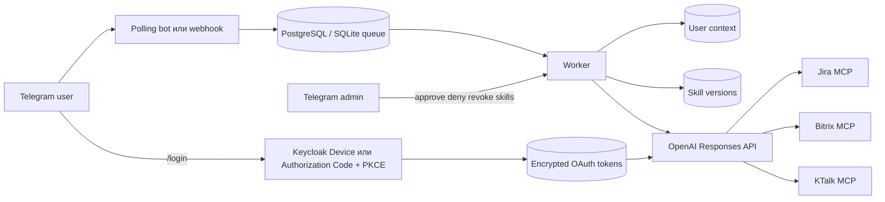

# Техническое решение MVP Modus Sales Telegram Bot

Актуально на 01.09.2026. Цель — проверить полезность, удобство и стоимость AI-агента на ограниченной известной группе без отдельной web-админки, сложных ролей, индивидуальных наборов tools и лимитов.

## Архитектура

Локальный режим использует Telegram long polling. Контур организации использует webhook/API и отдельный worker. БД хранит очередь, allowlist, контекст, зашифрованные OAuth-токены, версии skills, аудит и usage metrics.

## Доступ

- Администраторы задаются `ADMIN_TELEGRAM_IDS` и автоматически допускаются в пилот после `/start`.
- Неизвестный пользователь после `/start` получает `pending`; OpenAI и MCP не вызываются.
- Администратор получает Telegram-кнопки «Разрешить» и «Отклонить».
- При approve статус становится `active`; при deny/revoke — `revoked`.
- `/revoke <telegram_id>` удаляет контекст и OAuth-токены без перезапуска.
- Для всех пользователей действует один общий read-only MCP allowlist и общие глобальные экономические ограничения.

## Keycloak и MCP

`/login` запускает Device Flow локально либо Authorization Code + PKCE S256 после HTTPS-развёртывания. В обоих случаях используется public client без secret. Callback проверяет одноразовый state, TTL и активный доступ пользователя. Access/refresh token шифруются Fernet key из `TOKEN_ENCRYPTION_KEY` и привязываются к Telegram ID.

Перед каждым MCP-запросом worker получает токен текущего пользователя и автоматически обновляет истёкший access token. OpenAI Responses API получает его в поле `authorization` remote MCP tool. `/logout` вызывает revocation endpoint и удаляет локальные записи.

При ошибке optional MCP обычный запрос повторяется без MCP. Явная команда `/mcp <server> <query>` требует авторизацию и не скрывает ошибку выбранного сервера.

Конфигурация с `read_only=false` отклоняется. `allowed_tools` передаётся в Responses API. Сейчас утверждены только Jira tools; Bitrix и KTalk остаются отключены до live discovery и согласования.

## Контекст и skills

- Контекст изолирован по Telegram ID и chat ID, имеет TTL и лимит размера.
- `/new` удаляет контекст текущего диалога.
- Базовый prompt и skills загружаются из `config/project` на каждый запрос.
- Активная версия skill из БД заменяет Git-версию без перезапуска.
- Администратор выбирает skill через `/skills`, просматривает `/skill_show`, редактирует полный текст через `/skill_edit`, подтверждает diff кнопкой и возвращает предыдущую версию через `/skill_rollback`.
- Git-версия не удаляется; rollback первой DB-версии возвращает её.

## Безопасность и данные

- `store=false` для Responses API.
- OAuth tokens, Telegram/OpenAI secrets и Fernet key не попадают в Git, Jira, Telegram или логи.
- Текст job очищается после терминальной обработки.
- Usage metrics содержат обезличенный HMAC identifier, модель, tokens, duration, result и расчётную стоимость без полного текста диалога.
- Ответ сохраняется до успешной Telegram-доставки, поэтому retry доставки не повторяет OpenAI-вызов.
- Один worker сохраняет последовательность сообщений пилота; перед горизонтальным масштабированием нужен conversation lock.

## Текущие внешние зависимости

1. Public Keycloak client ID со Standard Flow + PKCE S256, Device Flow и refresh token.
2. Подтверждение issuer/audience/scopes для всех трёх MCP.
3. Утверждённые read-only tool names Bitrix и KTalk и контроль актуального Jira списка.
4. Live smoke каждого MCP и минимум одного сценария skill + MCP.
5. Для контура организации: host, TLS/DNS, исходящий HTTPS, защищённые переменные и backup PostgreSQL.

Запрос Keycloak: [keycloak-admin-request.md](keycloak-admin-request.md). Развёртывание: [deployment.md](deployment.md).

## Проверка

`scripts/verify.ps1` запускает Ruff, автоматические сценарии доступа, Device Flow, encryption/refresh/logout, MCP token isolation, skill edit/rollback, context, metrics, secret scan и HTTP smoke.

## Основания OpenAI

- [MCP and Connectors](https://developers.openai.com/api/docs/guides/tools-connectors-mcp)
- [Responses API](https://developers.openai.com/api/reference/resources/responses/methods/create)
