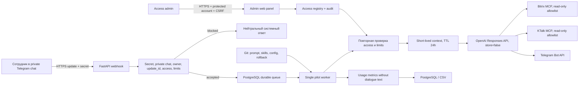

# Техническое решение Telegram-пилота sales AI-агента

Дата решения: 10.08.2026. Цель этапа — проверить полезность и стоимость токенной модели без доработок коробочного Bitrix24. Если экономика не проходит go/no-go критерии, Bitrix-интеграция не начинается.

## 1. Итоговая архитектура

Решение использует PostgreSQL и как реестр, и как очередь минимального пилота. Это сокращает инфраструктуру и сохраняет транзакционную дедупликацию. В пилоте запускается один worker: так последовательность одного диалога гарантируется без распределённых блокировок. Перед горизонтальным масштабированием нужен отдельный механизм conversation lock (PostgreSQL advisory lock либо очередь с partition key).

## 2. Компоненты и потоки данных

| Компонент | Назначение | Хранимые данные |
|---|---|---|
| Webhook/API | Быстро принять и проверить Telegram update | Полный update не журналируется |
| `user_access` | Закрытый allowlist и состояние доступа | Числовой Telegram ID, корпоративные ФИО/email, роль, лимиты, кто/когда подтвердил |
| `update_jobs` | Дедупликация, очередь, retry | Текст максимум 24 часа и только до успешной/терминальной обработки; затем очищается |
| `conversation_messages` | Ручной контекст для `store=false` | Последние 12 сообщений, максимум 24 000 символов, TTL 24 часа; `/new` и revoke удаляют сразу |
| Worker | Команды, OpenAI/MCP, Telegram delivery | Сейчас секреты извне приложения; целевое персональное OAuth-хранилище — зашифрованные записи PostgreSQL |
| `usage_events` | Экономика и SLA | HMAC user hash, scenario tag, request ID, result, latency, model, tokens, cost; без текста |
| `admin_audit` | Контроль выдачи прав | Администратор, действие, целевой Telegram ID, время; без диалога |

Webhook возвращает HTTP 200 после транзакционной постановки задачи. Уникальный `update_id` предотвращает второй job. Worker сохраняет сгенерированный ответ перед отправкой в Telegram: retry доставки не вызывает OpenAI повторно. После revoke worker повторно видит статус и не отправляет ранее не доставленный ответ.

## 3. Доступ и безопасность

Проверки до OpenAI/MCP: корректный webhook secret; `chat.type=private`; `from.id=chat.id`; числовой Telegram ID; статус `active`; пользовательские и глобальные лимиты. MCP tools вычисляются как пересечение глобального read-only allowlist и прав пользователя.

Состояния:

- `pending`: заявка после `/start`; доступ к OpenAI/MCP отсутствует;
- `active`: администратор сверил корпоративную личность, назначил роль, tools и лимиты;
- `revoked`: новые запросы блокируются, контекст удаляется немедленно.

Web-админка использует отдельную защищённую учётную запись, HTTP Basic за обязательным TLS, constant-time password comparison и CSRF. Для расширенного или постоянного использования её надо заменить корпоративным OIDC/SSO и отдельной ролью `access_admin`; пользовательская OAuth Bitrix24 не входит в пилот.

Сейчас bootstrap-секреты (Telegram token, webhook secret, OpenAI API key, admin password и `DATABASE_URL`) передаются извне контейнера через корпоративное хранилище секретов либо закрытый env-файл сервера. Они не входят в Git или Docker image. Production startup отклоняет пустые и dev-секреты. До live-пилота необходимо реализовать зашифрованное хранение персональных MCP access/refresh tokens в PostgreSQL; мастер-ключ остаётся только во внешнем хранилище.

Remote MCP имеет риск prompt injection и передачи данных третьей стороне. Поэтому write tools не включаются, серверы должны быть доверенными, а список методов фиксируется в Git после live discovery. Для будущих чувствительных методов `require_approval=always/filter`; `never` допустим только для утверждённых read-only методов.

## 4. Инфраструктура, доступы и зависимости

Минимальный стенд:

| Ресурс | Минимум | Ответственный/доступ |
|---|---|---|
| Linux VM или managed container | 2 vCPU, 4 GB RAM, 20 GB disk | DevOps; исходящий HTTPS к Telegram/OpenAI/MCP |
| PostgreSQL 17 | 1 БД, ежедневный backup, 7 дней retention | service account приложения |
| DNS + TLS reverse proxy | публичный HTTPS URL для webhook | DevOps/ИБ |
| Telegram bot | отдельный bot token + random secret_token | владелец пилота |
| OpenAI project | API key, budget alert/hard limit, разрешённая модель | OpenAI org admin |
| MCP Jira/Bitrix/KTalk | public OAuth client с Device Flow и минимальными scopes | владельцы MCP/Keycloak |
| Git/CI | protected main, review, image/tag rollback | команда разработки |
| Admin identity | пилот: отдельный password; далее OIDC `access_admin` | ИБ/IT |

Внешние зависимости: Telegram Bot API; OpenAI Responses API; доступность `https://mcp.modusbi.ru/bitrix/mcp` и `https://mcp.modusbi.ru/ktalk/mcp`; service authorization; исходный опубликованный prompt либо проверенный Git bundle; точный read-only список MCP tools.

## 5. Декомпозиция и оценка

Оценка дана в человеко-днях для одного backend-инженера; участие DevOps/ИБ/владельца sales-агента указано отдельно. Реализованный в этом репозитории mock-контур закрывает большую часть этапов 1–5 и 8, но live-интеграции зависят от внешних доступов.

| Этап | Результат | Backend, дн. | Прочие роли |
|---|---|---:|---:|
| 0. Инвентаризация | Точная версия prompt/skills/files, baseline 15–20 сценариев | 1.5 | Владелец 1.0 |
| 1. Runtime и БД | Web/worker, schema, конфигурация, healthchecks | 2.0 | DevOps 0.5 |
| 2. Telegram | Bot, webhook, secret, private-only, команды, dedupe | 2.0 | DevOps 0.5 |
| 3. Доступ и admin | pending/active/revoked, UI, аудит, лимиты, revoke | 4.0 | ИБ 1.0 |
| 4. Очередь и контекст | retry без дублей, TTL, `/new`, cleanup | 3.0 | — |
| 5. Responses API | `store=false`, safety ID, prompt version, usage | 2.5 | OpenAI admin 0.5 |
| 6. MCP | Service OAuth, discovery, read-only allowlist, 3 smoke cases | 4.0 | MCP/Keycloak 1.5 |
| 7. Метрики | PostgreSQL, CSV, cost formula, SQL/dashboard pivots | 1.5 | Аналитик 0.5 |
| 8. Hardening/demo | tests, TLS/deploy, backup, runbook, demo | 4.0 | DevOps 1.0, ИБ 0.5 |
| **Итого live pilot** |  | **24.5** | **7.0** |

Календарно: 4–5 недель одним backend-инженером при выдаче доступов в первую неделю; 3 недели при параллельной работе backend и DevOps и отсутствии задержки OAuth. Уже готовый mock-контур позволяет провести техническое демо сразу после локального запуска, но не является доказательством работоспособности реальных MCP.

## 6. План минимального демо

1. Запустить `scripts/docker-up.ps1` в mock-режиме и показать обработку `/start` контейнером.
2. Отправить `/start`: заявка `pending`, вызовов OpenAI/MCP нет.
3. В админке сверить сотрудника, назначить `pilot_user`, нулевой либо read-only tool allowlist, лимиты; показать audit.
4. Отправить два сообщения: второй ответ использует краткий контекст.
5. Повторно доставить тот же `update_id`: нового ответа нет.
6. Выполнить `/new`: контекст удалён.
7. Поставить запрос в очередь и отозвать доступ до worker: OpenAI не вызывается.
8. Показать `usage.csv`: tokens/cost/latency/scenario присутствуют, текста запроса нет.
9. Live-часть после доступов: Bitrix-only read, KTalk-only read, комбинированный `KTalk -> Bitrix`; подтвердить отсутствие write calls.

Критерий demo complete: все девять сценариев имеют сохранённые технические доказательства; реальные пункты 9 не заменяются mock-результатом.

## 7. План измерения токенов и стоимости

На каждый успешный API-запрос пишутся: UTC time, HMAC user hash, request ID, scenario (`crm_lookup`, `meeting`, `meeting_to_crm`, `draft_or_summary`, `other`), result, duration, exact model, input/cached/output tokens и расчётная стоимость. Формула:

`cost = (uncached_input × input_rate + cached_input × cached_rate + output × output_rate) / 1 000 000`.

Тарифы вынесены в environment, поскольку цены меняются; перед пилотом их сверяет владелец OpenAI project. Текущая конфигурация датирована 10.08.2026, а не является вечным прайс-листом.

Период измерения: минимум 20 рабочих дней, 8–15 подтверждённых пользователей, не менее 300 содержательных запросов. Еженедельно считать:

- API cost/user и cost/успешный сценарий;
- p50/p95 latency и долю ошибок/retry;
- tokens/request по scenario и пользователю;
- долю запросов с MCP и стоимость импортированных tool definitions;
- полезность: короткая ручная оценка 1–5 по выборке и доля задач, завершённых без перехода в ChatGPT;
- инфраструктурную стоимость и время сопровождения.

Сравнение с подпиской выполняется по фактическому счёту, без предположения о цене: `subscription_monthly_cost = invoice_total / paid_seats`. Полная API-модель: `API tokens + infrastructure + support labor + risk reserve`. Break-even по пользователю достигнут только если полная стоимость ниже фактической подписки и одновременно соблюдены quality/SLA guardrails.

Предлагаемый go/no-go после 20 дней:

- `GO`: не менее 70% пилотных задач оценены 4–5/5; p95 ответа до 45 секунд; ошибки до 5%; полная прогнозная месячная стоимость не выше 80% фактической стоимости заменяемых подписок;
- `TUNE`: качество проходит, но стоимость 80–120% — оптимизировать модель, prompt, context и tool allowlist ещё один цикл;
- `NO-GO`: стоимость выше 120%, качество ниже 70%, либо не закрыты security/MCP ограничения. Bitrix24 не дорабатывается.

## 8. Риски и открытые вопросы

| Риск/вопрос | Влияние | Мера/решение до live |
|---|---|---|
| Нет public OAuth client с Device Flow и персонального token store | Блокирует live tools | Завершить SH-519, реализовать `/connect`, refresh/revoke и зашифрованное хранение |
| Нет экспортированного current prompt/skills/files | Нельзя доказать сохранение поведения | Зафиксировать exact version/checksums или published prompt ID/version; прогнать baseline |
| Не утверждён точный список read-only tools | Риск лишних прав | Discovery, классификация side effects, approval владельца и ИБ |
| MCP не применяет права пользователя из token claims | Пользователь может видеть лишние данные | Проверить `aud`, scopes и авторизацию каждого MCP; использовать только per-user OAuth |
| Telegram account compromise = доступ к пилоту | Утечка/неправомерные запросы | Немедленный revoke, короткий контекст, лимиты, памятка пользователям |
| Telegram/OpenAI/MCP обрабатывают пользовательские данные | Compliance | Классификация данных, DPA/policy review, запрет чувствительных данных до согласования |
| Basic admin account недостаточен для постоянной эксплуатации | Админ-риск | TLS + unique strong password в пилоте; OIDC/MFA до расширения |
| Цена/модель меняются | Ошибочная экономика | Сохранять exact model и rates с датой; сверять invoice и pricing перед отчётом |
| Multi-worker нарушит порядок диалога | Дубли/перемешанный контекст | В пилоте replicas=1; advisory lock/partition queue до масштабирования |

Решения, которые нужны от владельцев до live: состав пилотной группы; фактическая цена/число заменяемых подписок; допустимые классы CRM/meeting данных; точная версия sales-agent bundle; public OAuth client с Device Flow; read-only tool allowlist; бюджет и hard limit OpenAI; OIDC для админки сейчас или после пилота.

## 9. Основания OpenAI

- [Model guidance: Responses API, `store=false`, manual history и `safety_identifier`](https://developers.openai.com/api/docs/guides/latest-model)
- [MCP and Connectors: `server_url`, authorization, `allowed_tools`, approvals и риски](https://developers.openai.com/api/docs/guides/tools-connectors-mcp)
- [Model catalog and current token prices](https://developers.openai.com/api/docs/models)
